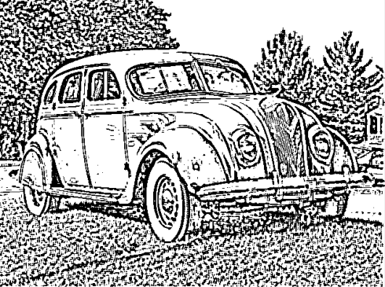

# Edge Filter

A Laplacian edge filter written with Keras/TensorFlow.

I wrote this as an exploration of Convolution filtering, while learning about computer vision from first-principles. As such, convolution kernels were manually hard-coded to effect the desired function.

In this case, I convert the video input to greyscale before sending into the convolution stack, then the first convolution layer applies a Guassian blur to the image.
We then apply a Laplacian convolution and feed the result into a binary mask. The output is a black and white image of the detected edges in the source image. This is looped for each frame in the video stream, and is very performant at ~10ms per frame.

## Installation

Install dependencies with Conda

```bash
conda env create -f environment.yml
conda activate tensorflow
```

Run the script

```bash
./edge_filter.py
```

Or use the included Jupyter Notebook

```bash
jupyter notebook edge_filter.ipynb
```

## Example





